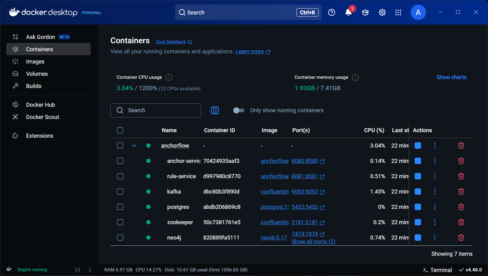
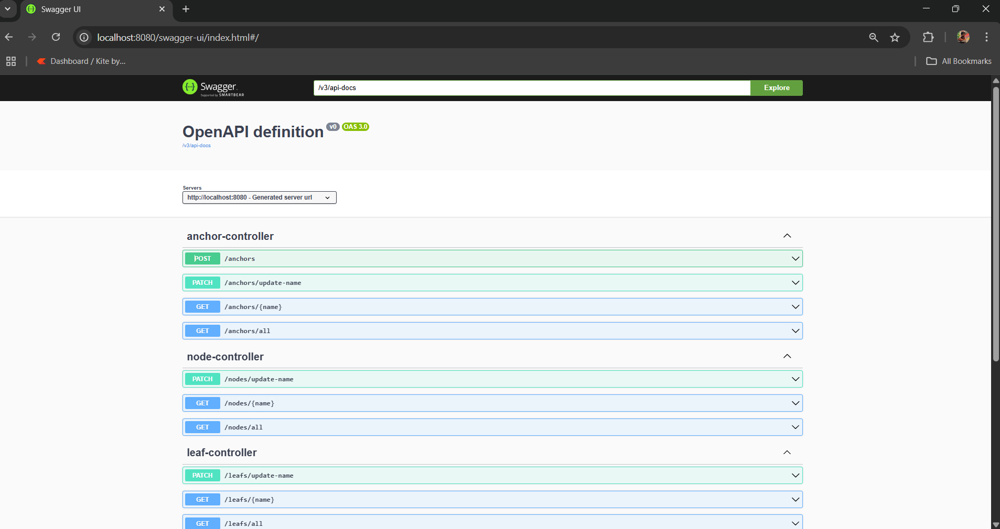
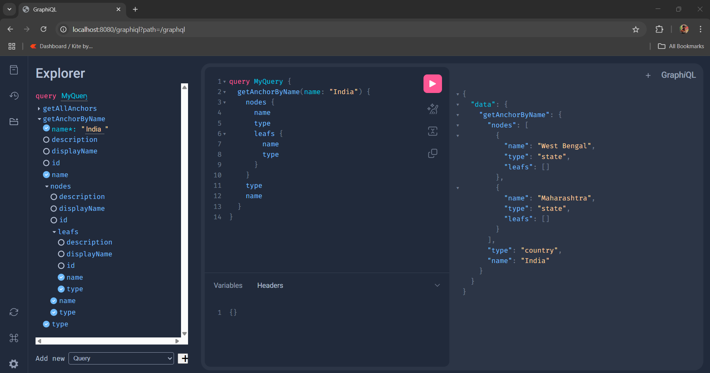

# AnchorFlow

AnchorFlow is a microservices application that manages hierarchical data structures using Neo4j graph database. It provides a robust solution for representing complex relationships between entities in a tree-like structure, with automatic display name management and audit logging.

Key Features:
- Multi-level hierarchical data management
- Automatic display name generation
- Real-time updates via Kafka
- Business logic management with Drools
- Comprehensive audit logging
- GraphQL and REST API support



## Prerequisites

- Java 17
- Docker Desktop
- Git

## Getting Started

1. Clone the repository:
```bash
git clone https://github.com/avisheku/anchorflow.git
cd anchorflow
```

2. Build and run the services:
```bash
docker-compose up --build
```

3. To stop and remove all containers and volumes:
```bash
docker-compose down -v
```

## Architecture & Database Access

### Services
- **Anchor Service** (`http://localhost:8080`)
  - GraphQL and REST APIs for data operations
  - Interactive API documentation

- **Rule Service** (`http://localhost:8081`)
  - Business logic and event processing with Drools and Kafka
  - Automatic display name management and audit logging

#### Display Name Rules
The system automatically generates display names for entities following these rules:
1. Anchor's display name is its name
2. Node's display name is `parentDisplayName-nodeName`
3. Leaf's display name is `parentDisplayName-leafName`

Example:
- Anchor: "India"
- Node: "India-Maharashtra"
- Leaf: "India-Maharashtra-Mumbai"

### Databases

#### Neo4j Graph Database

- Browser Interface: `http://localhost:7474`
- Username: neo4j
- Password: password

#### PostgreSQL Database

- Host: localhost
- Port: 5432
- Database: anchor_db
- Username: postgres
- Password: password

### API Documentation

#### Swagger UI

- Interface: `http://localhost:8080/swagger-ui.html`

#### GraphQL

- GraphiQL Interface: `http://localhost:8080/graphiql`

## Sample Data

### Netflix Content Structure Example


```json
{
  "name": "Netflix",
  "type": "Platform",
  "nodes": [
    {
      "name": "2023",
      "type": "Year",
      "nodes": [
        {
          "name": "Action",
          "type": "Genre",
          "leafs": [
            {
              "name": "Extraction 2",
              "type": "Movie"
            },
            {
              "name": "The Night Agent",
              "type": "Movie"
            }
          ]
        },
        {
          "name": "Drama",
          "type": "Genre",
          "leafs": [
            {
              "name": "The Diplomat",
              "type": "Movie"
            }
          ]
        }
      ]
    },
    {
      "name": "2024",
      "type": "Year",
      "nodes": [
        {
          "name": "Sci-Fi",
          "type": "Genre",
          "leafs": [
            {
              "name": "3 Body Problem",
              "type": "Movie"
            }
          ]
        }
      ]
    }
  ]
}
```

### Company Structure Example
```json
{
  "name": "TechNova Inc",
  "type": "company",
  "description": "A multinational tech company",
  "nodes": [
    {
      "name": "Engineering",
      "type": "department",
      "description": "Handles product development",
      "nodes": [],
      "leafs": [
        {
          "name": "Alice Johnson",
          "type": "employee",
          "description": "Senior Software Engineer"
        },
        {
          "name": "Bob Singh",
          "type": "employee",
          "description": "DevOps Engineer"
        }
      ]
    },
    {
      "name": "Marketing",
      "type": "department",
      "description": "Focuses on market research and brand management",
      "nodes": [],
      "leafs": [
        {
          "name": "Clara Fernandez",
          "type": "employee",
          "description": "Marketing Lead"
        },
        {
          "name": "David Kim",
          "type": "employee",
          "description": "Content Strategist"
        }
      ]
    }
  ]
}
```

### Geographic Structure Example
```json
{
  "type": "country",
  "name": "India",
  "displayName": "India",
  "nodes": [
    {
      "type": "state",
      "name": "West Bengal",
      "displayName": "West Bengal",
      "nodes": [
        {
          "type": "city",
          "name": "Kolkata",
          "displayName": "Kolkata"
        },
        {
          "type": "city",
          "name": "Durgapur",
          "displayName": "Durgapur"
        }
      ]
    },
    {
      "type": "state",
      "name": "Maharashtra",
      "displayName": "Maharashtra",
      "nodes": [
        {
          "type": "city",
          "name": "Mumbai",
          "displayName": "Mumbai"
        },
        {
          "type": "city",
          "name": "Pune",
          "displayName": "Pune"
        }
      ]
    }
  ]
}
```

## Contributing

1. Fork the repository
2. Create a feature branch
3. Commit your changes
4. Push to the branch
5. Create a Pull Request 